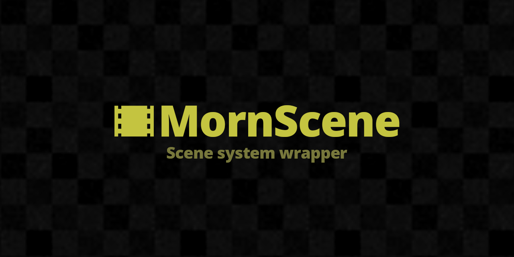

# MornScene

<p align="center">
  
</p>

<p align="center">
  
</p>

## 概要

Unity の SceneManager を統一して扱うシーン管理ラッパー。非同期ロード、ロールバック、シーン種別の文字列キー管理、Arbor 連携などを提供する。

## 導入方法

Unity Package Manager で以下の Git URL を追加:

```
https://github.com/TsukumiStudio/MornScene.git?path=src#1.0.0
```

`Window > Package Manager > + > Add package from git URL...` に貼り付けてください。

### 依存パッケージ

- [UniTask](https://github.com/Cysharp/UniTask) (`com.cysharp.unitask`)
- [Arbor](https://arbor.caitsithware.com/) (Arbor State 連携用)
- [MornGlobal](https://github.com/TsukumiStudio/MornGlobal) (`com.tsukumistudio.mornglobal`)
- [MornEnum](https://github.com/TsukumiStudio/MornEnum) (`com.tsukumistudio.mornenum`)

## ライセンス

[The Unlicense](LICENSE)
